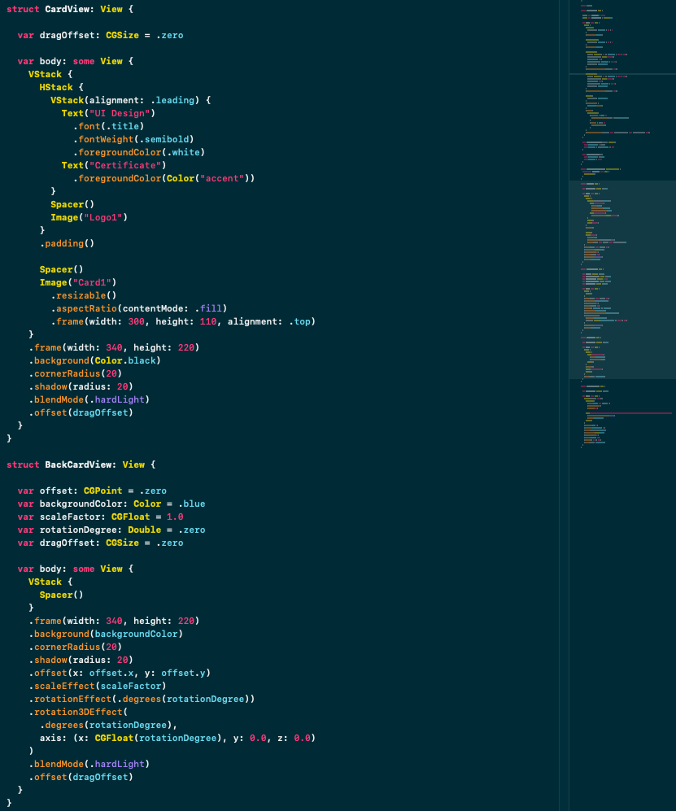

# musashi-xcode-theme



## Background

The Musashi theme is a combination of Solarized Dark background with Monokai accent colours.

This theme should work with Xcode 11 and 12.

## Installation

### Manual Installation
Copy the .xccolortheme file into the following directory:
```
~/Library/Developer/Xcode/UserData/FontAndColorThemes
```
- Restart Xcode
- Go to preferences and select **Musashi Dark (High Contrast)**
